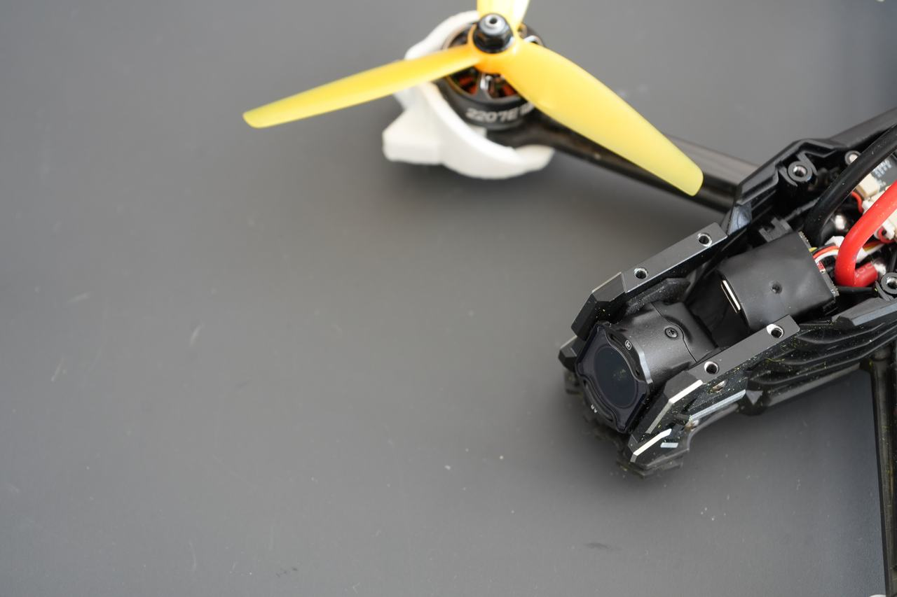

<picture>
  <source media="(prefers-color-scheme: dark)" srcset="assets/mark-on-ink.svg">
  
</picture>

# The Slate

**Arm the quad. The camera rolls.**

Your DJI Osmo starts recording the moment you arm, and stops when you disarm.
The camera's own state — recording, clip time, battery, card remaining — is
drawn onto your Betaflight OSD, so you know it is rolling before you leave the
ground. And if it is *not* rolling, the OSD says so in as many words rather than
leaving you to notice.

Save up to four cameras and it takes whichever one is switched on, in the order
you put them in — a Nano on the small quad, a 360 on the big one, no setup in
between.

Everything is set up from your phone over Wi-Fi. After the first flash you never
need a cable again, including for firmware updates — and the first flash is a
web page that works out which chip you have.

---

## What you need

| | |
|---|---|
| **Module** | An ESP32-C3 Supermini. This is the only board officially supported. |
| **Camera** | DJI **Osmo Nano**, **Osmo 360**, or an **Osmo Action** camera. |
| **Flight controller** | Betaflight **2025.12 or newer**, with one spare UART. This is a hard requirement — older firmware cannot draw the OSD text. |
| **A phone** | For setup. Any browser. |

The module draws about 80 mA from the flight controller's 5 V rail.

> **Antenna.** The board's printed antenna has to stick out past the frame.
> Carbon fibre blocks 2.4 GHz completely, and no setting compensates for an
> antenna sealed inside a carbon box.

---

## Wiring

Four wires to a spare UART:

| Module | Flight controller |
|---|---|
| `5V` | `5V` |
| `GND` | `GND` |
| `GPIO4` | UART **RX** |
| `GPIO5` | UART **TX** |

Transmit goes to receive, and the grounds must be common. In Betaflight's Ports
tab, no peripheral is needed on that UART — just leave it free.

> **Do not use GPIO2, GPIO8 or GPIO9.** They decide how the chip boots, and
> anything pulling on them at power-up stops it starting at all.

> **Never plug the module into USB with the flight battery in.** The shared 5 V
> wire ties them together, so USB back-feeds the flight controller and
> everything else on that rail. Two supplies in parallel through one wire is how
> regulators die. Battery out first, every time.

---

## Installing

You only do this once. After that, updates happen over Wi-Fi from your phone.

The easiest way is the browser tool below — it works out which chip is on your
board and installs the right firmware for it, so you never have to know which
file is yours. If you would rather do it by hand, grab
**`slate-<version>-<chip>-full.bin`** from [Releases](../../releases).

**Which chip?** If you bought a C3 Supermini, which is what this ships on, it is
`esp32c3`. There is no single file that works on all of them: an image carries
the chip it was built for in its header, and both the module's bootloader and
its own updater refuse a mismatch rather than half-flashing something that will
not boot.

**Only the C3 has flown.** The other images build, link and fit, and nobody has
bound a camera with one. Two of them are also louder: the C6 and C61 radios stop
at −15 dBm and the original ESP32 at −12 dBm, where the C3 reaches −24 dBm — so
the quietest setting on those parts still transmits more next to your receiver
than anything that has been flown here. Treat them as a starting point for a
port rather than as a supported board.

### From your browser

**<https://wingeratb.github.io/theslate/>**

Nothing to download and nothing to choose. The page reads which chip is on your
board and installs the firmware for it:

1. Plug the module into your computer with a USB-C cable, **with the flight
   battery out**.
2. Open the link in **Chrome or Edge** — it uses Web Serial, which Safari and
   Firefox do not have.
3. Click **Connect** and pick your module from the list the browser shows.

That is the whole job. When it finishes, unplug it and wire it to your flight
controller.

It offers two choices. **First time, or recovery** installs everything and
erases your settings, which is what you want on a new board. **Update** installs
new firmware and keeps your saved cameras and settings — though you can do that
from your phone over Wi-Fi instead, with no cable at all.

Nothing is uploaded anywhere. The page runs in your browser and talks to the
cable, and the firmware it serves is built by the same workflow that publishes
the page, from the same source as the release.

**If no device appears:** hold the module's BOOT button, tap RESET, then release
BOOT, and click Connect again. Some boards need this the first time. A cable
that only carries power and not data will also show nothing.

### Other ways, for the adventurous

If you would rather work in a terminal, the same file can be written with
Espressif's command-line `esptool` — installed with `pip install esptool`, or
downloaded as a standalone binary from
[its releases page](https://github.com/espressif/esptool/releases) if you would
rather not have Python involved.

Either way you are writing the same `-full.bin` to offset `0x0`, with `--chip`
set to the chip that file was built for. The browser tool above does exactly
this and asks fewer questions, so reach for the terminal only if you already
know you want to.

### The other file in each release

Every release also ships a **`-update.bin`**. That one is the app on its own,
and it is what the settings page installs over Wi-Fi. It is not
interchangeable with `-full.bin`: written at `0x0` it will not boot, because it
has no bootloader in front of it.

Use `-full.bin` for a cable. Use `-update.bin` for updates from your phone.

Both carry the chip in their name, and the updater checks it: hand it an image
built for a different chip and it refuses before writing a byte, rather than
staging something that cannot boot.

---

## Setting it up

Everything below is set from a page your phone opens. There is no app, no
account and no cable.

### Getting in

**Plug it into a computer.** A module on a USB cable is being set up, not flown,
so it comes up in setup on its own — no button hold, nothing to remember. It is
the *computer* that does it rather than the 5 V: the module looks for the frame
packets a USB host sends every millisecond, which a charger, a power bank and
your flight controller's own 5 V pad never send. Wired to an FC it boots
normally, every time.

**Or hold the module's button for ten seconds.** It reboots, the LED goes dark, and
an open Wi-Fi network called `SLATE-XXXX` appears — the last four characters
come from the board itself, so two modules in the same field are never confused.
Join it and the page opens on its own. If your phone does not offer it, go to
`http://192.168.4.1/`.

Once the module is buried in a frame and you cannot reach the button, use the
**setup switch** instead — see below. Setup is refused while armed, and arming
leaves it.

You do not need the flight controller powered to change settings. You do need it
if you want to watch a channel move while you pick one.

---

## Every setting

### Cameras

**Nearby** is a live list of what is in range, with signal bars. Pick yours and
confirm the four-digit code the camera shows. That pairing is remembered across
reboots, so this is a once-per-camera job.

The list stays in the order cameras were first seen. It does not re-sort itself
as signal changes — a list that reorders under your finger is worse than one
that is merely unsorted.

If the camera you want is not listed, it is off, asleep, or already connected to
a phone.

#### More than one camera

The module holds up to **four** cameras, and they appear above the Nearby list
with a number on the right. **On power-up it connects to the first one in that
order that is actually switched on** — so a Nano on the small quad and a 360 on
the big one can both live on the same module, and you swap by switching one on
and the other off rather than by opening this page.

**Drag a card to change the order.** Top is 1. Put the camera you fly most at
the top; it wins whenever both are on.

Two things worth knowing:

- **It never swaps mid-flight.** Once connected, that camera keeps the link
  until it goes away. A higher-priority camera switching on later does not take
  the link — ending a recording to satisfy a preference would be worse than
  flying the camera you already have.
- **Saving more cameras does not slow it down.** One scan sees every camera
  that is switched on, and the module picks from that — it does not try them
  one at a time, so four saved cameras connect as quickly as one.

**Tap a card to forget that camera.** It asks first. Forgetting only removes it
from this module — nothing on the camera itself changes — but to add it back it
has to be switched on and in range again.

Updating from a firmware that only held one camera keeps it, as the first entry.

### Recording

**What starts the clip.** Four modes:

| Mode | What happens |
|---|---|
| **Arm** | Arm starts recording, disarm stops it. |
| **Switch** | An RC channel controls recording; the arm switch is ignored. |
| **Cut** *(default)* | Arm starts the clip. A press cuts the current take and immediately starts a fresh one — it never leaves you not recording, it just breaks the footage into separate files. |
| **Both** | Arm starts and disarm stops, *and* the switch works independently on top: press mid-flight to stop, press again to start. Arming or disarming takes control back, so you always land on a stopped camera. |

On a module that has never had a switch configured, **Cut** behaves exactly like
**Arm**.

**Control type.** How your channel is read — this matters, and the right answer
depends on your transmitter:

- **Switch** — recording runs while the channel *sits inside* the window below.
  Position-driven, so after a flight-controller reboot or a brownout the module
  can look at the switch and know what you meant. Use this for a normal two- or
  three-position toggle.
- **Button** — every *movement* of the channel counts as one press, and each
  press flips recording. The window is ignored. Use this for a momentary button,
  which springs back and so has no position to test. The trade-off is that after
  a brownout the module cannot recover what the state was.

**Channel.** Any of AUX1–AUX14. It does not need to be mapped to anything in
Betaflight's Modes tab — the module reads the channel directly.

**Records above / …and below.** The microsecond window that counts as "on",
anywhere from 900 to 2100 µs. You do not have to know your numbers: move the
switch and watch the live marker, then drag the two handles around where it
lands. Recording runs while the marker is inside the shaded band.

Leave a little margin either side. Setting the edges exactly on the resting
value works until a trim or a rate change moves it a few microseconds.

### The module's own button

Not on the settings page, but worth knowing. The button has exactly two
gestures:

- **A tap** toggles recording, whatever the flight controller is doing. It is a
  test button — the quickest way to confirm on the bench that the camera is
  paired and listening, without arming anything.
- **A ten second hold** opens setup, as above.

---

### Post-roll

**0 to 30 seconds. Off by default.**

When the flight controller stops the recording — you disarm, or you crash — the
camera carries on for this long before actually stopping. A crash disarms the
quad, and the seconds you want are the ones *after* that: where it went, and
what it landed on.

Arming again during the countdown simply carries on recording, so it costs you
nothing on a normal landing. The OSD counts down (`REC 5`, `REC 4`…) so you can
see it happening rather than wondering why the camera is still running.

*Post-roll* is what broadcast calls the padding at the tail of a recording. Its
opposite — pre-roll, the seconds captured *before* the trigger — is something
the camera itself can do, and is not wired up here yet.

Pressing the module's button or your record switch stops **immediately**. This
only ever delays the automatic stop, never you. It is also dropped the moment
the flight controller link or the camera goes away — a dead UART still closes an
open clip, exactly as before.

---

### Warnings

**Warning** is an OSD field like any other — drag it onto a row of its own and
put that row wherever you want it, the way a flight controller puts its warnings
across the middle of the screen. It is blank space until something is wrong.

If you have *not* given it a row, the state field carries warnings instead, so a
module updating to this firmware does not silently lose them. Give warnings a
row and the state field goes back to plain `REC` / `IDLE`.

The module's LED also blinks fast when it has been asked to record and is not.
The most important warning wins:

| | Means |
|---|---|
| `NO SD` | No card, or the card is full. Nothing can be recorded. |
| `CAM HOT` | Too hot to record. |
| `NOT REC` | **You asked it to record and it is not.** |
| `BAT LOW` | Camera battery at or below your threshold. |
| `SD LOW` | Card time at or below your threshold. |

It blinks rather than sitting there, and on the off-beat you still see whether
it is recording — an alarm should not cost you the reading it is warning about.

`NOT REC` waits three seconds before it appears. Starting a recording takes a
Bluetooth round trip plus the camera's own shutter delay, and a warning that
fired on every single arm is one you would stop reading.

Nothing is ever warned about from a reading the camera has not confirmed. A
camera that has gone quiet is not a camera that is refusing, and the state field
already says `NO CAM` for that.

**Warn below camera battery** and **Warn below card time left** set the last
two. Either at zero switches that warning off. `NOT REC` has no threshold and
cannot be switched off — it is the reason this module exists.

---

### Radio power

**Low, Medium, High, Max.** How loudly the module talks to the camera. Low is
the flight default.

**Turn it down while flying.** With this on, the module uses your chosen setting
while disarmed and drops to Low for as long as the quad is armed. Setting up
wants reach — the camera may be across the room. Flying does not: the module is
centimetres from the camera and millimetres from your receiver, where being loud
buys nothing and costs the link that actually matters.

Turn this on and you can leave the setting on High without carrying it into the
air.

### Setup switch

Binds this settings page to an AUX channel, for a module you cannot physically
reach.

**Channel.** Any of AUX1–AUX14. Pick one you are not using for anything else.

**Control type.** *Switch* holds for a set time; *Button* enters instantly on
any movement of the channel.

**Hold for.** Zero to ten seconds, for switch mode. How long the switch must be
held up before the module is willing to open setup.

The gesture is narrated on your OSD so you are never guessing:

| The OSD says | Meaning |
|---|---|
| `ENTER` | The switch is up and the hold has started. |
| `READY` | The hold is complete. Drop the switch now to enter setup. |
| `CONFIG` | You are in setup. The camera link is down and the Wi-Fi page is up. |

Let go before `READY` and nothing happens. The switch only ever *opens* setup —
you leave with **Done & restart** at the bottom of the page, or by arming.
Nothing else on the aircraft will drop you out of the page while you are using
it.

**Setup is refused while armed, and arming leaves it.** A module in setup has no
camera link at all, so an aircraft that took off in that state would record
nothing and say nothing about why.

### Flight controller

Not a setting — a readout. It shows whether the MSP link is up and whether the
module currently sees you as armed. Use it to confirm your wiring and your UART
before you go looking for other problems.

### OSD layout

Drag the fields you want into four rows. Each row is one of Betaflight's four
custom messages and holds **16 characters**; the bar shows how much of that a
row has spent.

| Field | Looks like | Width |
|---|---|---:|
| **State** | `NO CAM` | 7 |
| **Clip time** | `12:34` | 7 |
| **Battery** | `BAT 87%` | 8 |
| **Battery %** | `87%` | 4 |
| **Card left** | `SD 1H49` | 8 |
| **Card** | `1H49` | 5 |
| **Alive dot** | `.` | 1 |
| **Camera** | `O360` | 4 |
| **Warning** | `NOT REC` | 7 |

**State** is the field to give a row to if you only pick one:

| It says | Meaning |
|---|---|
| `REC` | The camera is recording. |
| `IDLE` | The camera is connected and not recording. |
| `NO CAM` | No camera is talking to the module. |
| `REC 5` | Post-roll: still recording, counting down to the stop. |
| `ENTER` / `READY` / `CONFIG` | The setup switch gesture, as above. |

**Warning** is the other field worth a row. Give it one and it sits blank until
something is wrong, then flashes `NOT REC`, `NO SD`, `CAM HOT`, `BAT LOW` or
`SD LOW` — so you can put it across the middle of the screen where a flight
controller puts its own warnings. If you do not give it a row, the State field
carries those words instead. See [Warnings](#warnings).

Widths are worst cases, not what is on screen right now: a battery reading books
room for `100%` even while it says `87%`, and the clip timer books room for a
long flight. That is why the bar can look fuller than the text appears.

The **alive dot** blinks once a second while the module is talking to the
camera. If it stops, the module has stopped, and that is worth knowing at a
glance.

The **camera** field shows which camera is bound — `NANO`, `O360`, `A5` — and
disappears with the camera if it goes away.

### Firmware

Choose a `-update.bin` from the Releases page and install it. See
[Updating](#updating).

### Saving

**Done & restart** at the bottom writes everything and reboots the module back
into flying mode. Nothing is applied until you do.

---

## Updating

Open the settings page, choose the `-update.bin` from
[Releases](../../releases), and install. The module keeps the previous firmware
and rolls back to it by itself if the new one fails to run, so a bad update does
not leave you with a dead module inside a frame.

Your camera pairing and settings survive updates.

---

## Built on DJI's own protocols

The Osmo Action series and the Osmo 360 speak DJI's **R SDK** protocol, and this
project's implementation of it derives from DJI's own published
[Osmo-GPS-Controller-Demo](https://github.com/dji-sdk/Osmo-GPS-Controller-Demo).
The Osmo Nano speaks a different protocol, and the module works out which one
your camera uses when you pick it — you never have to know.

Attribution and the terms that came with DJI's code are in
[NOTICE](NOTICE). That component stays under its original MIT licence.

---

## Licence

**[PolyForm Strict 1.0.0](LICENSE).** The source is here to be read and run:
inspect it, build it, flash it on your own module, for any noncommercial
purpose. Hobby projects, personal builds, study and experiment are all expressly
permitted.

What the licence does **not** grant is the right to modify it, to redistribute
it, or to use it commercially — including selling hardware built on it.

That is deliberate rather than unfriendly. Publishing the source means you can
check what runs on your aircraft instead of taking my word for it, which is the
point. It does not mean handing someone a head start on selling the same thing.

If you want to do something the licence does not cover — a modification you
need, a commercial use, anything — ask. The answer is often yes.

One part is different: `components/dji_link/` derives from DJI's own published
demo and stays under its original MIT licence. See [NOTICE](NOTICE).

---

## Status

**1.1.0.** Read this in two halves, because they are not the same
standard of evidence.

**Flown, and working as intended** — everything that was in 1.0.0-beta1.
Verified in the air on an Osmo Nano and an Osmo 360: pairing, live camera
status, every record mode, the OSD, the AUX trigger as both a switch and a
momentary button, and firmware updates with rollback proven on hardware.

**New since 1.0, and not yet flown.** All of it builds, and the logic is covered by
host tests that compile the shipped source rather than a copy of it. None of it
has been in the air:

| | State |
|---|---|
| Warnings on the OSD and the LED | tested at a desk, not flown |
| Keep recording after landing | tested at a desk, not flown |
| More than one camera, in priority order | the list is host-tested; **the priority pick itself needs two cameras on a bench** |
| Five more chips (S3, C6, C61, C5, ESP32) | they build and the images fit. **Nobody has bound a camera with one.** Only the C3 has flown |
| Setup opening itself on a USB cable | tested on a C3 Supermini, not flown |
| The browser flasher | **tested** — installs the right image for the detected chip, over a real cable |

Two gaps are hardware rather than behaviour: there is no Osmo Action camera here
to test against, and no board other than the C3 Supermini. The Action speaks the
same protocol as the Osmo 360, which has flown.

Found a problem? [Open an issue](../../issues).

---

## Contributing

**I'm not taking pull requests.** The licence does not grant the right to make
derivative works, so a PR sits outside what it permits — and accepting one would
leave the author holding copyright on code I could not then license under the
same terms. Sorting that out means a contributor agreement, which is more
process than this project wants.

That is a licensing decision and nothing to do with the quality of anyone's
work. Please don't spend a weekend on a patch here; I would rather say so now
than after.

**Bug reports and questions are very welcome.** If something is broken, or the
OSD says one thing while your camera does another, [open an
issue](../../issues) — a good bug report is worth considerably more to this
project than a patch I cannot merge.
